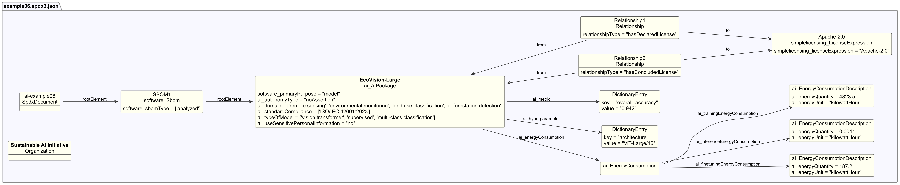

# AI profile example 06 — Energy consumption reporting

## Description

This example illustrates an SBOM for a large image classification model used
to monitor land use changes from satellite imagery.

The SBOM ([spdx3.0/example06.spdx3.json](./spdx3.0/example06.spdx3.json))
demonstrates the **`ai_energyConsumption` structure** — the primary focus of
this example — covering all three lifecycle stages required by emerging AI
transparency and sustainability regulations (e.g., EU AI Act, ISO/IEC 42001):

```text
ai_energyConsumption
├── ai_trainingEnergyConsumption    → 4,823.5 kWh  (32× A100, 14 days)
├── ai_finetuningEnergyConsumption  →   187.2 kWh  (domain adaptation)
└── ai_inferenceEnergyConsumption   →  0.0041 kWh  (per batch job)
```

Each stage uses an `ai_EnergyConsumptionDescription` object with
`ai_energyQuantity` (decimal) and `ai_energyUnit`
(`kilowattHour` / `megajoule` / `other`).

The example also uses `ai_autonomyType` (SPDX 3.0) to record autonomy level.

## Profile conformance

`core`, `ai`

## SPDX files

| Version | File |
| --------- | ------ |
| SPDX 3.0 | [spdx3.0/example06.spdx3.json](./spdx3.0/example06.spdx3.json) |
| SPDX 3.1 (draft) | [spdx3.1/example06.spdx3.json](./spdx3.1/example06.spdx3.json) |


[](./example06.spdx3.png)
## Key properties demonstrated

| Property | Notes |
| ---------- | ------- |
| `ai_autonomyType` | `noAssertion` — deprecated in SPDX 3.1, use `isoAutomationLevel` |
| `ai_energyConsumption` | All 3 stages (training, finetuning, inference) |
| `ai_finetuningEnergyConsumption` | 187.2 kWh |
| `ai_inferenceEnergyConsumption` | 0.0041 kWh per batch |
| `ai_standardCompliance` | ISO/IEC 42001:2023 |
| `ai_trainingEnergyConsumption` | 4,823.5 kWh |
