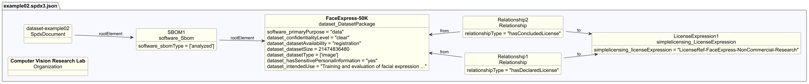

# Dataset profile example 02 — Image dataset

## Description

This example illustrates an SBOM for a labeled image dataset of human faces
used to train models that recognize facial expressions.

The SBOM demonstrates Dataset-profile properties for **image datasets**,
including data collection, preprocessing, known bias, and privacy sensitivity.

## Profile conformance

`core`, `dataset`

## SPDX files

| Version | File |
| --------- | ------ |
| SPDX 3.0 | [spdx3.0/example02.spdx3.json](./spdx3.0/example02.spdx3.json) |
| SPDX 3.1 (draft) | [spdx3.1/example02.spdx3.json-draft](./spdx3.1/example02.spdx3.json-draft) |

## Key properties demonstrated

| Property | Notes |
| ---------- | ------- |
| `dataset_confidentialityLevel` | `clear` — freely distributable (with license) |
| `dataset_dataCollectionProcess` | How the images were sourced |
| `dataset_dataPreprocessing` | Steps applied to prepare images before use |
| `dataset_datasetSize` | `21474836480` bytes (~20 GB) — deprecated in SPDX 3.1, use `software_artifactSize` |
| `dataset_datasetType` | `image` |
| `dataset_hasSensitivePersonalInformation` | `yes` — dataset contains images of people |
| `dataset_intendedUse` | Training/evaluation use cases — deprecated in SPDX 3.1, use Core `intendedUse` |
| `dataset_knownBias` | Demographic imbalances documented |
