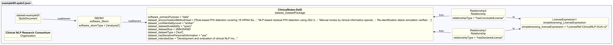

# Dataset profile example 05 — Sensitive personal data (clinical notes)

## Description

This example illustrates an SBOM for a dataset of de-identified medical notes
from a hospital, used for text analysis research.

The SBOM demonstrates Dataset-profile properties for
**datasets containing sensitive personal information**, covering anonymization
methods, access controls, availability mode, and research use restrictions.

## Profile conformance

`core`, `dataset`

## SPDX files

| Version | File |
| --------- | ------ |
| SPDX 3.0 | [spdx3.0/example05.spdx3.json](./spdx3.0/example05.spdx3.json) |
| SPDX 3.1 (draft) | [spdx3.1/example05.spdx3.json](./spdx3.1/example05.spdx3.json) |

## Key properties demonstrated

| Property | Notes |
| ---------- | ------- |
| `dataset_anonymizationMethodUsed` | Multi-step process to remove identifying information |
| `dataset_confidentialityLevel` | `amber` — access restricted to approved research organizations under data use agreements |
| `dataset_datasetAvailability` | `query` — accessible only via a controlled interface, not direct download |
| `dataset_datasetSize` | `2684354560` bytes (~2.5 GB) — deprecated in SPDX 3.1, use `software_artifactSize` |
| `dataset_hasSensitivePersonalInformation` | `yes` — originates from patient health records |
| `dataset_intendedUse` | Research use only — deprecated in SPDX 3.1, use Core `intendedUse` |
| `dataset_knownBias` | Single-institution patient population documented |
| `inLanguage` | `"en"` — new in SPDX 3.1, records the language(s) of a dataset |
