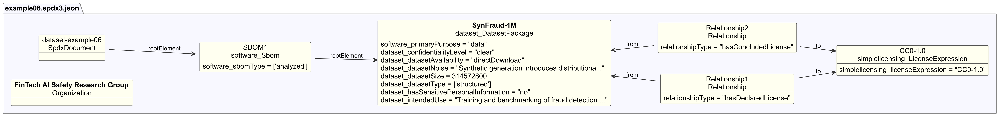

# Dataset profile example 06 — Synthetic dataset

## Description

This example illustrates an SBOM for a fully synthetic dataset of generated
financial transactions, created for fraud detection research where real
transaction data cannot be shared for privacy reasons.

The SBOM ([spdx3.0/example06.spdx3.json](./spdx3.0/example06.spdx3.json))
demonstrates Dataset-profile properties for **synthetically generated datasets**,
covering generation methodology, noise characteristics, dataset type, and
access controls.

## Profile conformance

`core`, `dataset`

## SPDX files

| Version | File |
| --------- | ------ |
| SPDX 3.0 | [spdx3.0/example06.spdx3.json](./spdx3.0/example06.spdx3.json) |
| SPDX 3.1 (draft) | [spdx3.1/example06.spdx3.json](./spdx3.1/example06.spdx3.json) |

## Key properties demonstrated

| Property | Notes |
| ---------- | ------- |
| `dataset_confidentialityLevel` | `clear` — freely distributable (CC0-1.0) |
| `dataset_dataCollectionProcess` | Generation methodology documented (not collection) |
| `dataset_datasetNoise` | Known limitations of synthetic generation |
| `dataset_datasetSize` | `314572800` bytes (~300 MB) — deprecated in SPDX 3.1, use `software_artifactSize` |
| `dataset_datasetType` | `structured` (tabular) |
| `dataset_hasSensitivePersonalInformation` | `no` — synthetic data contains no real customer records |
| `dataset_intendedUse` | Research only, not production deployment — deprecated in SPDX 3.1, use Core `intendedUse` |
